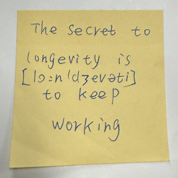

sometimes i travel with my family. and when that happens, sometimes i give up on planning and lazily book them a guided tour. and when that happens, sometimes i tag along. and when that happens, sometimes (two times, to be exact) i meet cool tour guides. this entry will be about the last tour guide i met and something extremely terrifying to me.

he was a really good storyteller. for most of the tour, we sat on a bus driven by him as he shared random trivia and different stories. these little events would span across days, but they all eventually came full circle. this is a nice time to share how much i love offbeat (?) storytelling. there’s so much charm in spending a long time on seemingly unrelated build-up just to segue into an (oftentimes trivial) point. if i were a good storyteller like him (or had better memory), i'd write this entry with his cadence and quote him better. sadly, i do not have his wit, and i don't think trying to emulate him is turning out great so far, so i'll just write how i usually would from this point on!

as i was dozing off towards the end of the tour on the bus, the tour guide suddenly asked if everyone liked their jobs. the bus was mostly quiet, but that did not stop him from talking to himself. eventually, he landed on a hypothetical: “if you were given a chance at a second life where you could decide how it would go, would you choose a stress-free life where you could eat and sleep as you please [more not-so-random stuff was said]...” at one point, i _knew_ he was going to segue koala bears into this conversation (the tour did not involve koala bears whatsoever). i semi-harshly whispered to my family, “he’s talking about koala bears,” half hoping other people would hear it just for the silly satisfaction that i was fully aware of what the guide was hinting at.

once, i lurked around outside the bus where he would smoke and talk to other guides who were also visiting the same spot. i found that he was more interesting than the travel spot. i only remember him talking about past jobs he had. from their tone and the sad smoking, i vaguely felt that they did not like their jobs much. it only made me more in awe of how good my tour guide was at his.

i think i would not mind being a koala bear. assuming i had a very smooth brain with little cognitive ability, i probably wouldn’t be as “aware” and hence would not have to think much. i believe this would remove a lot of fear and sadness from my life. it reminded me of a conversation i had with [Friend S] a few years back about [San Junipero](https://letterboxd.com/film/black-mirror-san-junipero/). it's quite similar to the koala hypothetical really: would you want to upload your consciousness and essentially be in digital heaven forever? [Friend S] said she would love it, but this idea terrifies me a lot because i don’t think i’d ever want my consciousness to exist forever. what if a glitch happens and somehow i am forever… aware? for a period of time, i was really into cosmic horror. there’s something eerie about the incomprehensible nature and vastness of the universe (細思極恐 is such a great phrase to describe this feeling). it's not completely similar to eternal consciousness, but i think there’s a big intersection, primarily when it comes to how absolutely helpless we would be. personally i think the most desirable outcome would be no afterlife. isn’t it scary to not be able to terminate yourself and to be forced to exist forever? what’s the point of dying if your mind just exists in another form? [Friend S] said that nothingness after death is scary, but i think endless consciousness (emphasis on how incomprehensible "endless" truly is) takes the cake for being the scariest outcome. i hope that when i'm done for, every form of me truly dies and permanently ceases.

some time ago, i watched [Eternal](https://letterboxd.com/film/eternity-2025-1/) with [Friend A] and a family member. you get little horror-esque glimpses shown in the background where NPCs try to escape because they grew sick of heaven. it was great. elizabeth olsen so pretty. [Friend A] taught me the phrase "another wrinkle in my brain!", which is such a cute way of saying TIL. 

this was written by the other tour guide i did not mention. he shared that he was learning english and passed me this sticky note.
